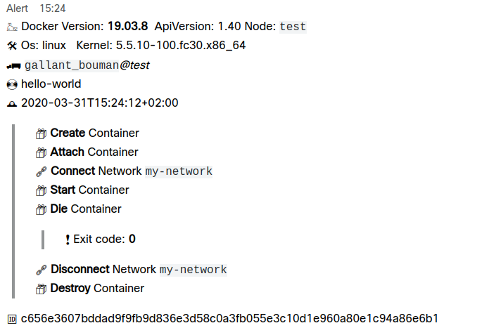

# Webhook Docker

A [Keybase](https://keybase.io), [Slack](https://slack.com) and [WebEx](https://www.webex.com/) integration to notify Docker Events via incoming webhook

## Keybase webhook setup

+ Add [webhookbot](https://keybase.io/webhookbot) from list of Bots
+ Create a new webhook for sending messages into the current conversation. You must supply a name as well to identify the webhook. Example: `!webhook create alerts`
+ Get the new URL to send webhooks


## Slack webhook setup

+ Setup [Incoming Slack](https://my.slack.com/services/new/incoming-webhook)


## WebEx webhook setup

+ Connect [Incoming Webhooks](https://apphub.webex.com/teams/applications/incoming-webhooks-cisco-systems)




## Run

Capture docker events and send to Keybase:

```shell
$ docker run --rm -v /var/run/docker.sock:/var/run/docker.sock:ro \
logocomune/webhook-docker:1.0.0 --keybase-endpoint=https://bots.keybase.io/webhookbot/....
```


Capture docker events and send to Slack:
```shell
$ docker run --rm -v /var/run/docker.sock:/var/run/docker.sock:ro \
logocomune/webhook-docker:1.0.0 --slack-endpoint=https://hooks.slack.com/services/....
```

Capture docker events and send to WebEx:
```shell
$ docker run --rm -v /var/run/docker.sock:/var/run/docker.sock:ro \
logocomune/webhook-docker:1.0.0 --webex-endpoint=https://api.ciscospark.com/v1/webhooks/incoming/....
```


### Application options

| flag | Environment |type | Default | |
| --- | --- | --- | --- | --- |
| --node-name | WD_NODE_NAME |String| | Node name. If empty use the hostname |
| --docker-show-running | WD_DOCKER_SHOW_RUNNING | Boolean | false | Send running container to webhook |
| --docker-listen-container-events | WD_DOCKER_LISTEN_CONTAINER_EVENTS | Boolean | true | Listen for container events |
| --docker-listen-network-events | WD_DOCKER_LISTEN_NETWORK_EVENTS | Boolean | true | Listen for network events | 
| --docker-listen-volume-events |WD_DOCKER_LISTEN_VOLUME_EVENTS | Boolean | true | Listen for volume events | 
| --keybase-endpoint | WD_KEYBASE_ENDPOINT | String | |  Keybase endpoint for webhook |
| --slack-endpoint | WD_SLACK_ENDPOINT | String | | Slack endpoint for webhook |
| --webex-endpoint | WD_WEBEX_ENDPOINT | String | | WebEx endpoint for webhook |

